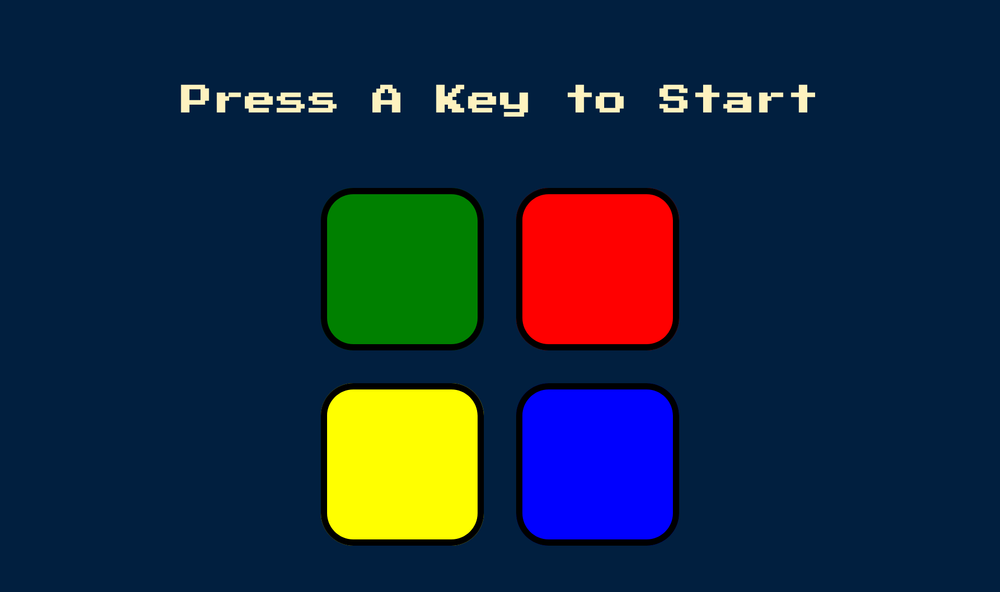
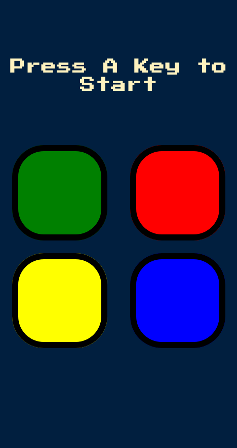

# Simon Game

A fun mini game to test your memorize skill. Game consists of 4 button. In each stage, computer will randomly picked a button.
As a player, you need to remember each button which have been picked by the computer in all stage in order to win this game.

## Screenshot
- Desktop Preview /

- Mobile Preview /

## Links

- Solution URL: [solution](https://github.com/Biggboss7/Simon-Game)
- Live Site URL: [live site](https://willowy-creponne-34c2b8.netlify.app)

## Author

- Github - (https://github.com/Biggboss7/)
